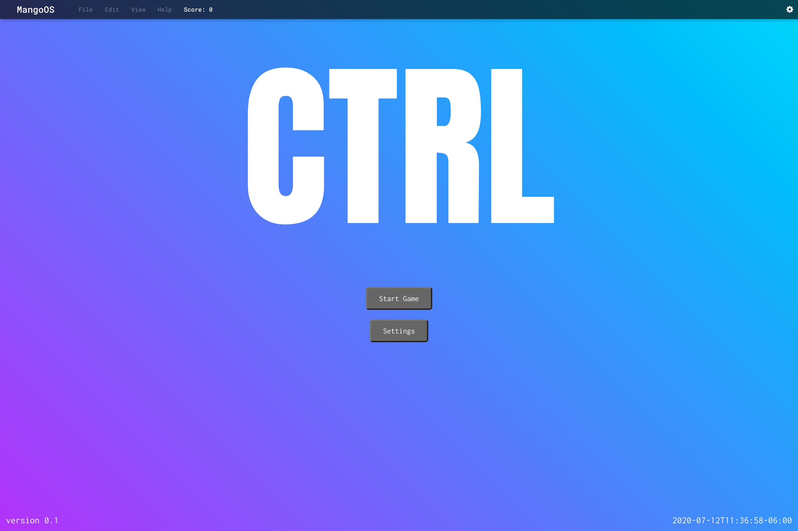
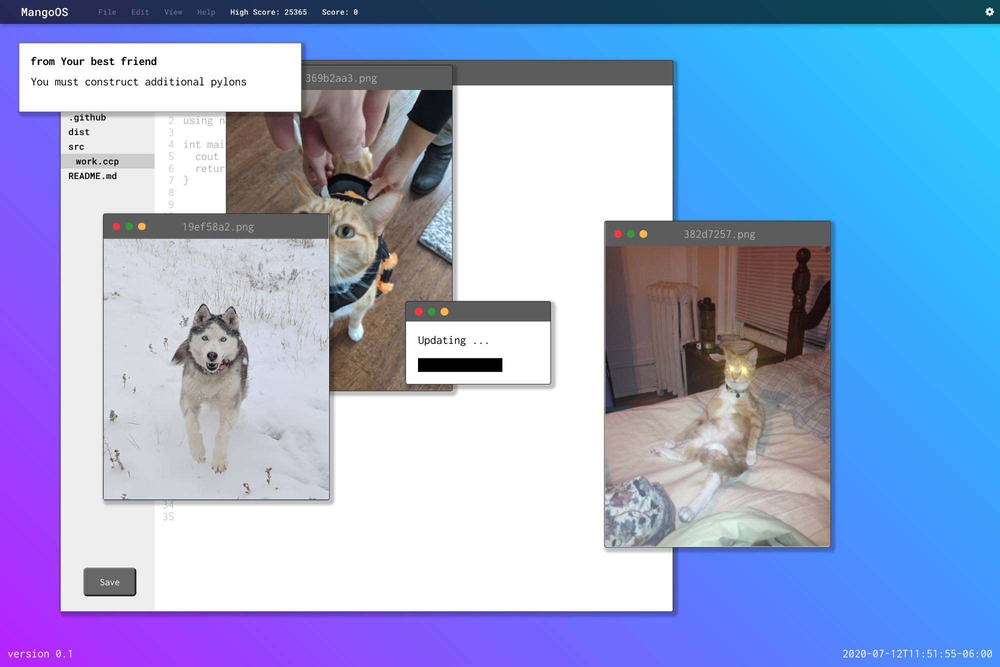
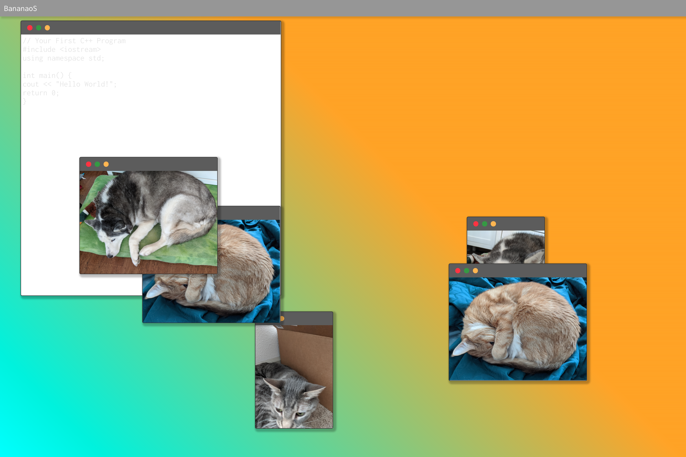

# Ctrl

If you land here before the [GMTK Game Jam 2020](https://itch.io/jam/gmtk-2020) ends, please leave us a rating on [our submission page](https://itch.io/jam/gmtk-2020/rate/697767). An honest rating would be most appreciated.

A game about finishing your work without letting the distractions get out of control. [Play Here](https://wolfadex.github.io/gmtk-gamejam-2020/)

=======

To get started run:

- `npm i`
- `npm run dev`

Most editors support JSX syntax, though Sublime can be a little wonky. 
If you're using VSCode or Atom you should be perfectly fine.

##  In-Progress Screenshots (newest to oldest):

KEYBOARD EFFECTS FROM www.FesliyanStudios.com