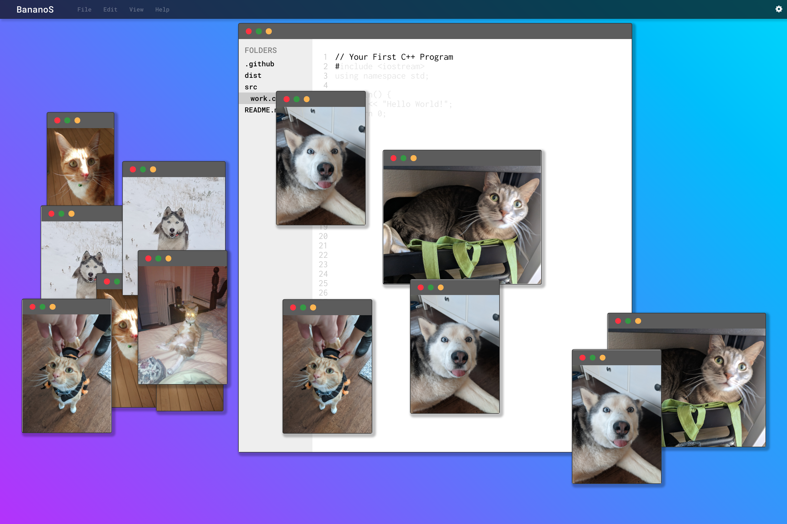

# Ctrl
A game about keeping control of the system.
=======
To get started run:

- `npm i`
- `npm run dev`

Most editors support JSX syntax, though Sublime can be a little wonky. 
If you're using VSCode or Atom you should be perfectly fine.

##  In-Progress Screenshots (newest to oldest):

